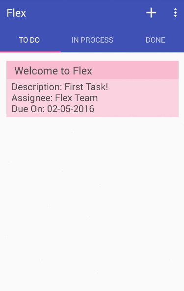

# Flex  
> Based and built on the idea of *Flex Friday* by students at [Baxter Academy](http://baxter-academy.org) 

A collaboration board towards team progress for projects. :page_facing_up:  

## Tasks 
- To Do
- In Process
- [Done](https://github.com/baxter-oop/baxter-app)

## Preview

## Features 
- Assign `tasks` to team members and yourself  
- Goal tracker and personal todo list  
- Mark and manange tasks in `progress levels`  
- Work more, procrastinate less  

## Release History 
+ [1.0.0](https://github.com/baxter-oop/baxter-app/releases/tag/1.0.0) - Initial Release

## Team 
 | 
---|---
[Wil W.L.](https://github.com/wilstenholme) | [John Z.](https://github.com/JCharante)

## License 
 